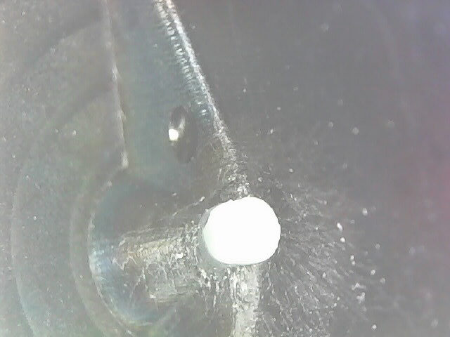
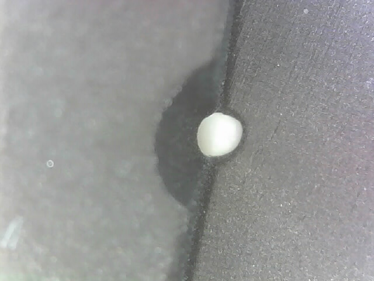
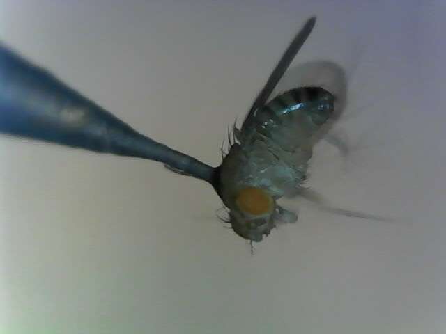

# Holder 

These designs are related to holding a fly in place, for example during an experiment. This could be head fixation plates, where flies are directly glued to like [Flyplate5](Flyplate5.stl), or one of the other holders to tether the fly body to.

## Flyplate5

The [Flyplate5](Flyplate5.stl) was designed at [Janelia Experimental Technology (jET)](https://www.janelia.org/support-team/janelia-experimental-technology) and is the 5th iteration of the design. For this design, the head of the fly is glued to the tip of the cone on one side of the plate. After glueing the fly, it is possible to dissect parts of the head, i.e. for patch clamping and brain imaging. The inner part of the cone tends to be filled with liquid that provides nutrients to the animal and can be imaged through. The upper part of the cone is big enough for a microscope lens to be lowered into the liquid. The other end of the plate can be fixed to a kinematic base (eg [Thorlabs KBT1X1](https://www.thorlabs.com/thorproduct.cfm?partnumber=KBT1X1)) to easily mount it either at the tethering station, imaging rig, or experimental setup.

Initially the design was machined according to the specification in the design files. The result is very sturdy and can be re-used many times. The following images shows a machine Fly Plate after having been used many times:

We recently started to see if 3D printing could work as well. We have not run experiments yet, but the print itself looks as follows:

## Holder cone

During behavioral experiments, the thorax of flies is tethered to a thin thread. The conic holders represent different approaches on how to mount the thin thread to material that is big enough for manual and robotic pickup. In one of the setups, we are using a magnet that has the inverse form of the wider cone, for example as shown in [Holder-cone_pointy](Holder-cone_pointy.stl). For this particular design, we tried to glue the thinner and pointy end to the fly. The design [Holder-cone_pointy_tip-0.07](Holder-cone_pointy_tip-0.07.stl) is intended for a similar use, and in fact the results are show here:

Just a quick explanation of the design – which should be similar for many of the other holder designs as well: The wide cone ending in a cylindrical form will be attached to counter piece with the inverse shape. Note that one part from the circumfence is cut of. This keying of the form is used to orient the holder in its pickup form. The gap inside the cylinder can house a [1/16" thick, 1/4" OD magnet](https://www.mcmaster.com/5862k141). Using a static magnet has the advantage that an inverse electro-magnetic field can be used to push the holder away from the pickup. Instead, a metal piece can be used if only static magnetism is needed. The long and thin cylindric share below the large and flat cylinder is required to provide space for the mount. Finally, the conic pointy end on the other side is where the fly is going to be attached. One of the weak spots of this design is that 3D printer use support material inside the magnet gap and through its closed form, it's not all washed out during the cleaning process. This problem is addressed in later designs, such as [Holder-cone_pointy_neck-wedge](Holder-cone_pointy_neck-wedge.stl). Here an additional but smaller opening on the opposite side of where the magnet is slipped in, allows better cleaning.

Talking about the [Holder-cone_pointy_neck-wedge](Holder-cone_pointy_neck-wedge.stl): this is an attempt to see how thin current printers like the [Form 3](../README.md) can currently print. This never really worked, but we keep it to test future printers.

Similarly, a number of designs have a hole instead of the pointy end. These holes come at different diameters to account for different printing materials and leave just enough room, to glue a thinner metal thread into that gap. In addition to the cylindrical holes, the size and quality of which largely depends on the printer, printing material, and some environmental factors, [Holder-cone_flat_helical-cutout](Holder-cone_flat_helical-cutout.stl) uses a different way to form a holder for the tether: Similarly the steps in a spiral staircase, helical cutouts are situated around the center. Their overlap over different of these steps form a space that can be used to glue in the fly tether.

All of these designs have been replaced by a Luer lock based holder:

## Holder Luer

Based on the observation, that flies seem to behave ok in experiments when tethered to a [34 gauge dispensing needle](https://www.amazon.com/dp/B07KGPDSHX/). The design [Holder-Luer](Holder-Luer.stl) is an adapter between the wide conic magnetic pickup and a luer lock for the dispensing needles.